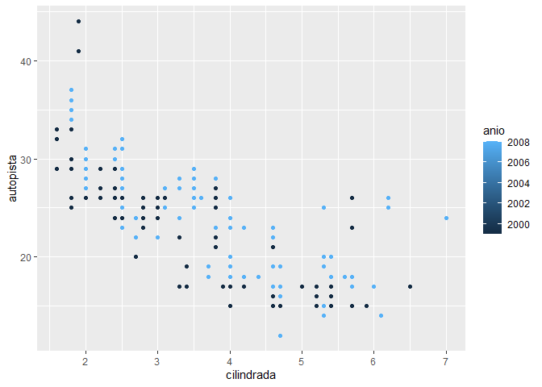
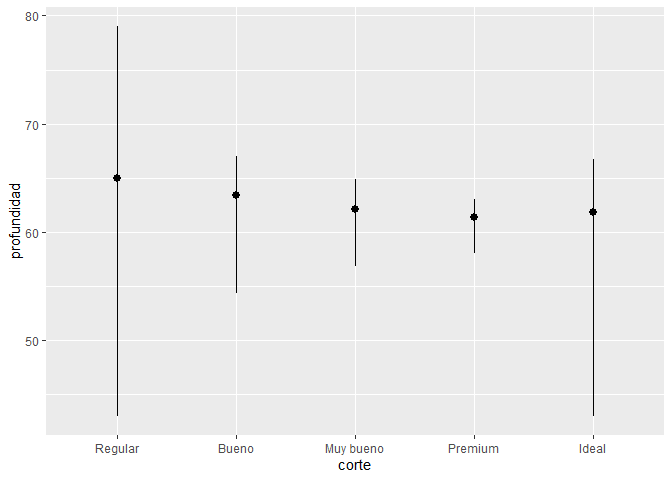

GGPLOT
================
Cesar Quiroz, Danae Quispe & Gabriel Ricra
18/1/2022

# Instalación de paquetes

``` r
library(tidyverse)
```

    ## Warning: package 'tidyverse' was built under R version 4.1.2

    ## -- Attaching packages --------------------------------------- tidyverse 1.3.1 --

    ## v ggplot2 3.3.5     v purrr   0.3.4
    ## v tibble  3.1.6     v dplyr   1.0.7
    ## v tidyr   1.1.4     v stringr 1.4.0
    ## v readr   2.1.1     v forcats 0.5.1

    ## Warning: package 'ggplot2' was built under R version 4.1.2

    ## Warning: package 'forcats' was built under R version 4.1.2

    ## -- Conflicts ------------------------------------------ tidyverse_conflicts() --
    ## x dplyr::filter() masks stats::filter()
    ## x dplyr::lag()    masks stats::lag()

``` r
library(datos)
```

# 1. Dplyr - filter

## 1.1 Ejecuta ggplot(data = millas). ¿Qué observas?

``` r
#La parte de plots está sin ningún gráfico en blanco.
```

## 1.2 ¿Cuántas filas hay en millas? ¿Cuántas columnas?

``` r
dim(millas)
```

    ## [1] 234  11

## 1.3 ¿Qué describe la variable traccion? Lee la ayuda de ?millas para encontrar la respuesta.

``` r
#Describe el tipo de tracción, sea "d" que representa la delantera, "t" la trasera y "4" 4 ruedas.
```

## 1.4 Realiza un gráfico de dispersión de autopista versus cilindros.

``` r
ggplot(millas, aes(autopista, cilindros)) +
  geom_point()
```

<!-- -->

## 1.5 ¿Qué sucede cuando haces un gráfico de dispersión (scatterplot) de clase versus traccion? ¿Por qué no es útil este gráfico?

``` r
#No se puede realizar gráfica de dispersión en scatterplot porque en ambas varibales se tienen que son datos de tipo categórico.
```

# 2. Mapeos estéticos

## 2.1 ¿Qué no va bien en este código? ¿Por qué hay puntos que no son azules?

``` r
ggplot(data = millas) +
   geom_point(mapping = aes(x = cilindrada, y = autopista, color = "blue"))
```

<!-- -->

``` r
#“, color = "blue"” debe ir fuera del paréntesis donde se asignan a las estéticas.
```

## 2.2 ¿Qué variables en millas son categóricas? ¿Qué variables son continuas? (Pista: escribe ?millas para leer la documentación de ayuda para este conjunto de datos). ¿Cómo puedes ver esta información cuando ejecutas millas?

``` r
#Para conocer el tipo de las variables en millas se utiliza “summary(millas)” dónde ‘fabricante’, ‘modelo’, ‘transmision’, ‘traccion’, ‘combustible’ y ‘clase’ son categóricas; y ‘cilindrada’, ‘anio’, ‘cilindros’, ‘ciudad’ y ‘autopista’ son variables continuas. Para visualizar toda la información de millas se utiliza la función “view()” pero si solo es para las primeras observaciones se recomienda “head()”. 
```

## 2.3 Asigna una variable continua a color, size, y shape. ¿Cómo se comportan estas estéticas de manera diferente para variables categóricas y variables continuas?

``` r
ggplot(data = millas) +
  geom_point(mapping = aes(x = cilindrada, y = autopista, color = anio))
```

<!-- -->

``` r
ggplot(data = millas) +
  geom_point(mapping = aes(x = cilindrada, y = autopista, size = anio))
```

<!-- -->

``` r
#ggplot(data = millas) + 
  #geom_point(mapping = aes(x = cilindrada, y = autopista, shape = anio))
#para el shape no es posible una variable continua.

#Las variables continuas crean una leyenda que está a la derecha del gráfico, ésta, en lugar de tener colores definidos utiliza un degradado y en el tamaño sucede algo similar. En cambio en la forma no plotea algo porque ggplot2 solo puede usar 6 formas a la vez por lo que una variable continua no puede ser mapeada en forma.
```

## 2.4 ¿Qué ocurre si asignas o mapeas la misma variable a múltiples estéticas?

``` r
# Tomando de ejemplo la siguiente gráfica
ggplot(data = millas) +
  geom_point(mapping = aes(x = cilindrada, y = autopista, color = autopista,
                           size = autopista))
```

<!-- -->

``` r
# En este caso lo que sucedió fue que el tamaño y el color de la variable continua se combinaron como se aprecia en la gráfica.
```

## 2.5 ¿Qué hace la estética stroke? ¿Con qué formas trabaja? (Pista: consulta ?geom_point)

``` r
#Realiza el grosor de los bordes de las 25 formas predefinidas e identificadas en números que se puedan hacer con los elementos del geom_point
```

## 2.6 ¿Qué ocurre si se asigna o mapea una estética a algo diferente del nombre de una variable, como aes(color = cilindrada \< 5)?

``` r
ggplot(data = millas) +
  geom_point(mapping = aes(x = cilindrada,
                           y = autopista, color = cilindrada <5))
```

<!-- -->

``` r
#Se genera un gráfico donde el tamaño del motor del automóvil,menores a 5 litros lo toma como verdadero(TRUE) y está con un color determinado mientras que a los valores mayores a 5 litros lo toma como falso (FALSE) y también está con un color determinado
```

# 3. Facetas

## 3.1 ¿Qué ocurre si intentas separar en facetas una variable continua?

``` r
ggplot(data = millas) +
  geom_point(mapping = aes(x = anio, y = autopista)) +
  facet_grid(. ~ cilindrada)
```

<!-- -->

``` r
#Se generan demasiados gráficos y no se logra apreciar de buena manera por ello para el face_wrap() se sugiere utilizar variables discretas o categóricas.
```

## 3.2 ¿Qué significan las celdas vacías que aparecen en el gráfico generado usando *facet_grid(traccion \~ cilindros)*? ¿Cómo se relacionan con este gráfico?

``` r
ggplot(data = millas) +
  geom_point(mapping = aes(x = traccion, y = cilindros))
```

<!-- -->

``` r
ggplot(data = millas) +
  geom_point(mapping = aes(x = traccion, y = cilindros)) +
  facet_grid(traccion ~ cilindros)
```

<!-- -->

``` r
# Significa que no hay datos que cumplan las condiciones.
```

## 3.3 ¿Qué grafica el siguiente código? ¿Qué hace?

``` r
ggplot(data = millas) +
  geom_point(mapping = aes(x = cilindrada, y = autopista)) +
  facet_grid(traccion ~ .)
```

<!-- -->

``` r
ggplot(data = millas) +
  geom_point(mapping = aes(x = cilindrada, y = autopista)) +
  facet_grid(. ~ cilindros)
```

<!-- -->

``` r
#Se observa la división en cada una de las gráficas en una de las variables esto se pueden realizar por el facet_grid(), es como si se pudiera ver gráficas dentro de una sola gráfica.  
```

## 3.4 Mira de nuevo el primer gráfico en facetas presentado en esta sección:

``` r
ggplot(data = millas) +
  geom_point(mapping = aes(x = cilindrada, y = autopista)) +
  facet_wrap(~ clase, nrow = 2)
```

<!-- -->

## 3.5 ¿Cuáles son las ventajas de separar en facetas en lugar de aplicar una estética de color? ¿Cuáles son las desventajas? ¿Cómo cambiaría este balance si tuvieras un conjunto de datos más grande? - Lee ?facet_wrap. ¿Qué hace nrow? ¿Qué hace ncol? ¿Qué otras opciones controlan el diseño de los paneles individuales? ¿Por qué facet_grid() no tiene argumentos nrow y ncol? - Cuando usas facet_grid(), generalmente deberías poner la variable con un mayor número de niveles únicos en las columnas. ¿Por qué?

``` r
#La ventaja de separar en facetas en lugar de colores es que la gráfica es más ordenada para el análisis por clase ya que envuelve la secuencia de paneles en 2 dimensiones. Las acciones de nrow y ncol son simplemente el de proporcionar el número de filas y columnas que se visualizarán en la gráfica. En facet_grid() en lugar de esos argumentos se emplea row y cols.
```

# 4. Objetos geométricos

## 4.1 ¿Qué geom usarías para generar un gráfico de líneas? ¿Y para un diagrama de caja? ¿Y para un histograma? ¿Y para un gráfico de área?

``` r
#geom_line(), geom_boxplot(), geom_histogram() y geom_area()
```

## 4.2 Ejecuta este código en tu mente y predice cómo se verá el output. Luego, ejecuta el código en R y verifica tus predicciones.

``` r
ggplot(data = millas, mapping = aes(x = cilindrada, y = autopista, color = traccion)) +
  geom_point() +
  geom_smooth(se = FALSE)
```

    ## `geom_smooth()` using method = 'loess' and formula 'y ~ x'

<!-- -->

``` r
#Predicción:
#En el output en el eje “x” estará cilindrada y en el eje “y” estará autopista y el color de los puntos (geom_point()) dependerá de la tracción, luego se hará un geom_smooth que se negó, en consecuencia, en el gráfico no estará el suavizado.
#Verificación:
#Al momento de correr el código verificamos la predicción ya que se usaron 2 geom. El primero geom_point() que sirve para un gráfico de puntos y el color de los puntos estará en función a la tracción, luego de ello se puede visualizar una línea de tendencia mas no el suavizado ya que se negó en el geom_smooth()
```

## 4.3 ¿Qué muestra *show.legend = FALSE*? ¿Qué pasa si lo quitas? ¿Por qué crees que lo utilizamos antes en el capítulo?

``` r
#Al correr show.legend = FALSE lo que hace es eliminar la leyenda del gráfico. Si lo quito aparece la leyenda. En el capítulo de objetos geométricos se utilizó porque al momento de hacer comparación con los gráficos, el argumento ‘color = traccion’ creará una leyenda.

ggplot(data = millas) +
  geom_smooth(mapping = aes(x = cilindrada, y = autopista, color = traccion))
```

    ## `geom_smooth()` using method = 'loess' and formula 'y ~ x'

<!-- -->

``` r
ggplot(data = millas) +
  geom_smooth(mapping = aes(x = cilindrada, y = autopista, color = traccion), show.legend = FALSE)
```

    ## `geom_smooth()` using method = 'loess' and formula 'y ~ x'

<!-- -->

## 4.4 ¿Qué hace el argumento se en geom_smooth()?

``` r
#Ajusta curvas a los datos, por ejemplo, si hacemos un gráfico de dispersión nos sería de ayuda realizar una línea que muestre la tendencia inherente a los mismos, para ello usaremos el geom_smooth() para poder realizar dicha tendencia al gráfico.
```

## 4.5 ¿Se verán distintos estos gráficos? ¿Por qué sí o por qué no?

``` r
ggplot(data = millas, mapping = aes(x = cilindrada, y = autopista)) +
  geom_point() +
  geom_smooth()
```

    ## `geom_smooth()` using method = 'loess' and formula 'y ~ x'

<!-- -->

``` r
ggplot() +
  geom_point(data = millas, mapping = aes(x = cilindrada, y = autopista)) +
  geom_smooth(data = millas, mapping = aes(x = cilindrada, y = autopista))
```

    ## `geom_smooth()` using method = 'loess' and formula 'y ~ x'

<!-- -->

``` r
#Los gráficos son iguales, porque la data y la estética son la misma. Se puede evitar este tipo de repetición pasando el conjunto de mapeos a ‘ggplot()’.
```

## 4.6 Recrea el código R necesario para generar los siguientes gráficos:

``` r
ggplot(data = millas) + 
  geom_point(mapping = aes(x = cilindrada, y = autopista)) + 
  geom_smooth(mapping = aes(x = cilindrada, y = autopista), se=F)
```

    ## `geom_smooth()` using method = 'loess' and formula 'y ~ x'

<!-- -->

``` r
ggplot(data = millas) + 
  geom_point(mapping = aes(x = cilindrada, y = autopista)) + 
  geom_smooth(mapping = aes(x = cilindrada, y = autopista, line = traccion), se=F)
```

    ## Warning: Ignoring unknown aesthetics: line

    ## `geom_smooth()` using method = 'loess' and formula 'y ~ x'

<!-- -->

``` r
ggplot(data = millas) + 
  geom_point(mapping = aes(x = cilindrada, y = autopista, color = traccion)) + 
  geom_smooth(mapping = aes(x = cilindrada, y = autopista, line = traccion, color = traccion), se=F)
```

    ## Warning: Ignoring unknown aesthetics: line

    ## `geom_smooth()` using method = 'loess' and formula 'y ~ x'

<!-- -->

``` r
ggplot(data = millas) + 
  geom_point(mapping = aes(x = cilindrada, y = autopista, color = traccion)) + 
  geom_smooth(mapping = aes(x = cilindrada, y = autopista), se=F)
```

    ## `geom_smooth()` using method = 'loess' and formula 'y ~ x'

<!-- -->

``` r
ggplot(data = millas) + 
  geom_point(mapping = aes(x = cilindrada, y = autopista, color = traccion)) + 
  geom_smooth(mapping = aes(x = cilindrada, y = autopista, linetype = traccion), se=F)
```

    ## `geom_smooth()` using method = 'loess' and formula 'y ~ x'

<!-- -->

``` r
ggplot(data = millas) + 
  geom_point(mapping = aes(x = cilindrada, y = autopista, stroke = 3), color = "white") + 
  geom_point(mapping = aes(x = cilindrada, y = autopista, color = traccion))
```

<!-- -->

# 5.0 Gráficos estadísticos

## 5.1 ¿Cuál es el geom predeterminado asociado con stat_summary()? ¿Cómo podrías reescribir el gráfico anterior para usar esa función geom en lugar de la función stat?

``` r
ggplot(data = diamantes) +
  stat_summary(mapping = aes(x = corte, y = profundidad), fun.min = min, fun.max = max, fun = median)
```

<!-- -->

``` r
# Los geoms asociados para mostrar la data resumida son 'geom_errorbar()',  'geom_pointrange()', 'geom_linerange()' y 'geom_crossbar()' que en este caso para reescribir la función empleare el 'geom_pointrange()'

ggplot(data = diamantes) +
  geom_pointrange(mapping = aes(x = corte, y = profundidad), stat = "summary", fun.min = min, fun.max = max, fun = median)
```

<!-- -->

## 5.2 ¿Qué hace geom_col()? ¿En qué se diferencia de geom_bar()?

``` r
# Tanto como ‘geom_col()’ y ‘geom_bar()’ son gráficas de barras. En ‘geom_col()’ la altura de las barras representa valores en la data, utiliza ‘stat_identity()’ y requiere de ‘x’ y ‘y’. En ‘geom_bar()’ la altura de la barra es proporcional al número de casos en cada grupo, solo requiere a la variable ‘x’ y utiliza ‘stat_count()’
```

## 5.3 La mayoría de los geoms y las transformaciones estadísticas vienen en pares que casi siempre se usan en conjunto. Lee la documentación y haz una lista de todos los pares. ¿Qué tienen en común?

``` r
#Primero se lee la documentación de ggplot2 y luego usando la función ‘grepl()’ que busca las coincidencias con el patrón del argumento dentro de cada elemento de un vector de variables categóricas.
obj <- getNamespaceExports("ggplot2")
geoms <- obj[grepl("geom_", obj)]
stats <- obj[grepl("stat_", obj)]

#Luego, encontrar a los que tienen los mismos sufijos. 

geoms_filtrados <- sort(geoms[geoms %in% paste0("geom_", gsub("stat_", "", stats))])
stats_filtrados <- paste0("stat_", gsub("geom_", "", geoms_filtrados))
pares <- tibble::tibble(geoms = geoms_filtrados,
               stats = stats_filtrados)

knitr::kable(pares, "html")
```

<table>
<thead>
<tr>
<th style="text-align:left;">
geoms
</th>
<th style="text-align:left;">
stats
</th>
</tr>
</thead>
<tbody>
<tr>
<td style="text-align:left;">
geom_bin_2d
</td>
<td style="text-align:left;">
stat_bin_2d
</td>
</tr>
<tr>
<td style="text-align:left;">
geom_bin2d
</td>
<td style="text-align:left;">
stat_bin2d
</td>
</tr>
<tr>
<td style="text-align:left;">
geom_boxplot
</td>
<td style="text-align:left;">
stat_boxplot
</td>
</tr>
<tr>
<td style="text-align:left;">
geom_contour
</td>
<td style="text-align:left;">
stat_contour
</td>
</tr>
<tr>
<td style="text-align:left;">
geom_contour_filled
</td>
<td style="text-align:left;">
stat_contour_filled
</td>
</tr>
<tr>
<td style="text-align:left;">
geom_count
</td>
<td style="text-align:left;">
stat_count
</td>
</tr>
<tr>
<td style="text-align:left;">
geom_density
</td>
<td style="text-align:left;">
stat_density
</td>
</tr>
<tr>
<td style="text-align:left;">
geom_density_2d
</td>
<td style="text-align:left;">
stat_density_2d
</td>
</tr>
<tr>
<td style="text-align:left;">
geom_density_2d_filled
</td>
<td style="text-align:left;">
stat_density_2d_filled
</td>
</tr>
<tr>
<td style="text-align:left;">
geom_density2d
</td>
<td style="text-align:left;">
stat_density2d
</td>
</tr>
<tr>
<td style="text-align:left;">
geom_density2d_filled
</td>
<td style="text-align:left;">
stat_density2d_filled
</td>
</tr>
<tr>
<td style="text-align:left;">
geom_function
</td>
<td style="text-align:left;">
stat_function
</td>
</tr>
<tr>
<td style="text-align:left;">
geom_qq
</td>
<td style="text-align:left;">
stat_qq
</td>
</tr>
<tr>
<td style="text-align:left;">
geom_qq_line
</td>
<td style="text-align:left;">
stat_qq_line
</td>
</tr>
<tr>
<td style="text-align:left;">
geom_quantile
</td>
<td style="text-align:left;">
stat_quantile
</td>
</tr>
<tr>
<td style="text-align:left;">
geom_sf
</td>
<td style="text-align:left;">
stat_sf
</td>
</tr>
<tr>
<td style="text-align:left;">
geom_smooth
</td>
<td style="text-align:left;">
stat_smooth
</td>
</tr>
<tr>
<td style="text-align:left;">
geom_spoke
</td>
<td style="text-align:left;">
stat_spoke
</td>
</tr>
</tbody>
</table>

``` r
#Lo común es que el sufijo es el mismo en la geometría y en la estadística, esto se debe a que cada geom tiene una stat predeterminada y cada stat tiene un geom predeterminado.
```

## 5.4 ¿Qué variables calcula stat_smooth()? ¿Qué parámetros controlan su comportamiento?

``` r
#Las variables que proporciona el ‘stat_smooth()’ son:
#‘y’ o ‘x’: valores previstos
#‘ymin’ o ‘xmin’: intervalo de confirmación puntual inferior en torno a la media
#‘ymax’ o ‘xmax’: intervalo de confirmación puntual superior alrededor de la media
#‘se’: error estándar
#Los parámetros que controlan su comportamiento son:
#method: loess, lm, MASS::rlm, etc.
#formula: y ~ x
#method.arg: Argumentos para el método
#se: Muestra el intervalo de confianza
#na.rm: Si es FALSE los valores faltantes serán removidos con una advertencia, si es TRUE serán removidos silenciosamente.
```

## 5.5 En nuestro gráfico de barras de proporción necesitamos establecer group = 1. ¿Por qué? En otras palabras, ¿cuál es el problema con estos dos gráficos?

``` r
ggplot(data = diamantes) +
  geom_bar(mapping = aes(x = corte, y = after_stat(prop)))
```

<!-- -->

``` r
ggplot(data = diamantes) +
  geom_bar(mapping = aes(x = corte, fill = color, y = after_stat(prop)))
```

<!-- -->

``` r
# Sin group = 1 las proporciones son calculadas para cada grupo (cada barra),  por ello todas las barras tienen altura 1.

ggplot(data = diamantes) +
  geom_bar(mapping = aes(x = corte, y = after_stat(prop), group = 1))
```

<!-- -->

``` r
#El problema con el gráfico es que las barras no todas estaban calculadas para todos los grupos.
```

# 6.0 Ajuste de posición

## 6.1 ¿Cuál es el problema con este gráfico? ¿Cómo podrías mejorarlo?

``` r
ggplot(data = millas, mapping = aes(x = ciudad, y = autopista)) +
  geom_point()
```

<!-- -->

``` r
# En este diagrama de dispersion se puede analizar de las observaciones en el conjunto de datos que hay mas de lo que hay en el grafico. Este problema se le conoce como solapamiento, para evitar esto se establece el ajuste de  posicion en 'jitter'.
ggplot(data = millas, mapping = aes(x = ciudad, y = autopista)) +
  geom_point(position = "jitter")
```

<!-- -->

## 6.2 ¿Qué parámetros de geom_jitter() controlan la cantidad de ruido?

``` r
#'width’: Cantidad de jitter horizontal. El jitter se añade en ambas direcciones, positiva y negativa, por lo que la dispersión total es el doble del valor especificado aquí.
#‘height’: Cantidad de jitter vertical. El jitter se añade en ambas direcciones, positiva y negativa, por lo que la dispersión total es el doble del valor especificado aquí.
```

## 6.3 Compara y contrasta geom_jitter() con geom_count()

``` r
ggplot(data = millas, mapping = aes(x = ciudad, y = autopista)) +
  geom_jitter()
```

<!-- -->

``` r
ggplot(data = millas, mapping = aes(x = ciudad, y = autopista)) +
  geom_count()
```

<!-- -->

``` r
ggplot(data = millas, mapping = aes(x = ciudad, y = autopista, color = clase)) +
  geom_count(position = "jitter")
```

<!-- -->

## 6.4 ¿Cuál es el ajuste de posición predeterminado de geom_boxplot()? Crea una visualización del conjunto de datos de millas que lo demuestre.

``` r
ggplot(data = millas, mapping = aes(x = ciudad, y = autopista, color = clase)) +
 geom_boxplot()
```

<!-- -->

``` r
ggplot(data = millas, mapping = aes(x = ciudad, y = autopista, color = clase)) + 
  geom_boxplot(position = "identity")
```

<!-- -->

# 7. Sistema de coordenadas

## 7.1 Convierte un gráfico de barras apiladas en un gráfico circular usando coord_polar().

``` r
ggplot(millas, aes(x = factor(1), fill = traccion)) +
  geom_bar()
```

<!-- -->

``` r
ggplot(millas, aes(x = factor(1), fill = traccion)) +
  geom_bar(width = 1) +
  coord_polar(theta = "y")
```

<!-- -->

## 7.2 ¿Qué hace labs()? Lee la documentación.

``` r
#Genera etiquetas que son fundamentales para la accesibilidad de los gráficos hacia un público más amplio. Utilizando el título y el subtítulo del gráfico para explicar los principales resultados. La etiqueta puede utilizarse para añadir etiquetas de identificación para diferenciar entre varios gráficos.
```

## 7.3 ¿Cuál es la diferencia entre coord_quickmap() y coord_map()?

``` r
#?coord_quickmap
#?coord_map
#La diferencia está que en el coord_map() en las proyecciones de mapas, en general, no conservan las líneas rectas mientras que en el  coord_quickmap() si se da la conservación de líneas 
```

## 7.4 ¿Qué te dice la gráfica siguiente sobre la relación entre ciudad y autopista? ¿Por qué es coord_fixed() importante? ¿Qué hace geom_abline()?

``` r
ggplot(data = millas, mapping = aes(x = ciudad, y = autopista)) +
  geom_point() +
  geom_abline() +
  coord_fixed()
```

<!-- -->

``` r
#Al ver el gráfico en el plot nos podemos dar cuenta que ciudad y autopista son directamente proporcionales, es decir, mientras haya más ciudades habrá más autopistas. 

#?coord_fixed
#Es importante en un sistema de coordenadas de escala fija ya que obliga a establecer una relación específica entre la representación física de las unidades de datos en los ejes. 

#?geom_abline
#Nos permiten agregar líneas de referencia a una parcela, ya sea horizontal, vertical o diagonal (especificada por pendiente e intersección).
```
